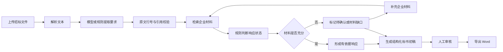
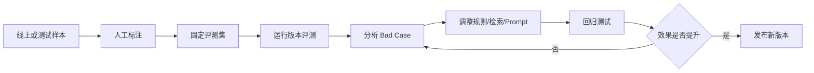

# 标策 BidPilot｜AI 标书 Agent 产品需求文档

> 文档类型：作品集 PRD  
> 版本：V1.0  
> 更新日期：2026-09-23  
> 产品形态：面向软件服务企业售前与投标团队的本地 AI 工作台  
> 文档状态：已实现能力复盘 + 下一阶段规划

---

## 1. 文档目的

本 PRD 用于说明 BidPilot 的业务问题、用户流程、AI 方案、功能范围、评测体系、成本与安全边界，并作为产品、算法、研发、测试和面试评审的统一依据。

本项目同时承担 AI 产品经理作品集的作用，重点展示以下能力：

- 从企业投标场景中识别用户、决策者、付费方及风险承担者。
- 将模糊业务问题拆解为结构化需求、Agent 工作流和可验收功能。
- 理解大模型、Prompt、证据检索、结构化输出、人工审核和降级策略。
- 建立测试集、效果指标、Bad Case 与迭代闭环。
- 关注 Token 成本、响应时间、数据安全和企业交付边界。

## 2. 项目背景

### 2.1 业务现状

软件服务企业参与政务、教育和园区数字化项目投标时，售前或投标专员通常需要完成以下工作：

1. 阅读招标文件并整理资格、技术、商务和时间要求。
2. 在企业材料库中查找营业执照、资质、人员证书、项目案例和服务方案。
3. 判断企业是否满足要求，记录缺失材料并协调业务负责人补充。
4. 编写技术与服务方案、逐条响应表及附件清单。
5. 多轮检查是否遗漏条款、误用材料或作出无法兑现的承诺。

上述工作具有文本量大、重复检索多、协作链路长和合规风险高的特点。通用大模型可以提升写作速度，但容易产生无依据的资质、案例、数字和服务承诺，不能直接作为正式投标文件使用。

### 2.2 核心问题

| 问题 | 业务后果 | 产品机会 |
|---|---|---|
| 招标条款分散且表达不统一 | 遗漏资格条件或关键时间节点 | 自动提取并保留原文位置 |
| 企业材料依赖人工搜索 | 查找时间长、材料版本容易混用 | 建立企业材料库与证据匹配 |
| 生成式 AI 可能编造事实 | 形成虚假承诺和合规风险 | 以证据约束生成，缺失时强制占位 |
| 缺口通过聊天或表格分散跟进 | 责任不清、补充后没有及时更新标书 | 建立“缺口—补材料—重算—再生成”闭环 |
| 只看生成结果，无法判断系统质量 | 迭代缺乏客观依据 | 固定测试集、Bad Case 和版本回归 |
| 模型调用成本不可见 | 难以评估规模化使用的 ROI | 记录 Token、耗时和调用操作 |

## 3. 产品定位

### 3.1 产品定义

BidPilot 是一款投标响应辅助 Agent。系统读取招标文件，将要求转为结构化清单，从投标企业材料中检索证据，识别材料缺口，并生成带引用、可继续编辑的 Word 标书初稿。

产品采用“要求—证据—响应”三层结构。大模型负责条款抽取和正式语言生成，本地规则负责证据检索、状态判断、数字约束和降级处理，关键结果由人工复核。

### 3.2 目标用户

| 角色 | 核心任务 | 主要痛点 | 产品价值 |
|---|---|---|---|
| 投标专员 | 整理条款、编制标书、汇总附件 | 重复整理、容易遗漏 | 自动生成清单和初稿 |
| 售前经理 | 设计技术方案、协调企业资源 | 材料分散、响应时间紧 | 快速定位依据和缺口 |
| 交付/技术负责人 | 确认服务能力和技术承诺 | 担心过度承诺 | 明确展示待确认项 |
| 商务负责人 | 确认合同条款和报价 | 报价边界复杂 | 报价缺失时强制人工补充 |
| 部门负责人 | 决定是否参与投标 | 缺少整体风险视图 | 查看满足情况和关键缺口 |

### 3.3 决策者、付费方与潜在阻力

- 决策者：售前负责人、投标管理负责人、企业数字化负责人。
- 付费方：销售或售前部门、企业信息化部门。
- 主要使用者：投标专员、售前经理。
- 潜在阻力：担心岗位被替代的标书人员、担心错误承诺的法务与交付团队、担心文件泄露的信息安全部门。
- 产品策略：定位为辅助核查和初稿工具，将原文、证据、缺口与人工审核显式呈现，不以全自动替代专业人员为目标。

## 4. 产品目标与非目标

### 4.1 产品目标

1. 将可复制文字的招标文件转换为可追溯的要求清单。
2. 为每项要求匹配企业材料，并区分“有依据、待确认、材料缺口、待跟进”。
3. 允许用户从缺口条款直接补充材料并自动重新匹配。
4. 生成正式结构的标书初稿，材料不足时统一标记 `【待补充】`。
5. 通过固定标注集衡量要求、证据、状态和最终响应质量。
6. 记录实际模型调用的 Token 与耗时，为成本测算提供基础。

### 4.2 当前非目标

- 不自动生成无法验证的报价金额。
- 不替代法务、商务和项目负责人作出正式承诺。
- 不验证营业执照、证书或合同原件的真实性。
- 不处理扫描件 OCR、复杂图表和完整招标排版。
- 不直接完成电子签章、投标平台提交和保证金支付。
- 当前版本不提供企业级多租户、SSO、权限审批和完整审计能力。

## 5. 成功指标

### 5.1 北极星指标

**可核查正确响应率**：在标注集中，要求被正确提取、状态判断正确、首要证据正确且响应遵守防编造规则的条款，占全部标注要求的比例。

当前离线规则基线为 **81.1%（60/74）**。该结果来自合成测试集，不代表真实生产效果，也不能归因于大模型。

### 5.2 AI 效果指标

| 指标 | 定义 | 当前基线 | 方向 |
|---|---|---:|---|
| 要求召回率 | 被识别的标注要求 / 全部标注要求 | 93.2% | 越高越好 |
| 要求准确率 | 能对应标注的提取要求 / 全部提取要求 | 100% | 越高越好 |
| 状态准确率 | 状态判断正确数 / 已匹配要求数 | 92.8% | 越高越好 |
| 首要证据准确率 | Top1 证据正确数 / 已评估要求数 | 94.2% | 越高越好 |
| 错误“完全响应”率 | 实际不满足却判断有依据 / 全部有依据判断 | 11.8% | 越低越好 |
| 可核查正确响应率 | 提取、状态、证据、生成均正确 / 全部标注 | 81.1% | 越高越好 |

### 5.3 产品与业务指标

以下为下一阶段需要真实用户验证的目标，不作为当前项目已实现成果：

| 指标 | 计算方式 | 验证目标 |
|---|---|---|
| 首轮条款整理时长 | 上传到完成首轮审核的时间 | 相比纯人工降低 50% |
| 缺口闭环率 | 已补充并重新确认的缺口 / 全部缺口 | ≥80% |
| 人工修改率 | 生成后发生实质修改的响应 / 全部响应 | 持续下降 |
| 任务完成率 | 成功导出可编辑标书的项目 / 创建项目 | ≥70% |
| 单项目模型成本 | 项目全部模型调用费用之和 | 建立基线后按版本下降 |
| 用户采纳率 | 被保留的 AI 响应 / 全部 AI 响应 | ≥60% |

## 6. 用户故事

### 6.1 核心用户故事

- 作为投标专员，我希望上传招标文件后得到完整要求清单，以免遗漏关键条款。
- 作为售前经理，我希望每项判断都能查看招标原文和企业依据，以便快速复核。
- 作为投标专员，我希望系统明确标出材料不足，而不是生成看似完整的虚假响应。
- 作为材料负责人，我希望从缺口条款直接添加材料，并立即看到状态是否改变。
- 作为技术负责人，我希望服务时限和技术指标保持招标原文，避免模型擅自修改数字。
- 作为商务负责人，我希望无可靠报价时显示 `【待补充】`，避免自动生成金额。
- 作为产品经理，我希望使用固定测试集比较版本效果，并查看 Bad Case、Token 和耗时。

### 6.2 关键使用场景

1. 首次分析：用户上传新招标文件，系统提取要求并匹配现有企业材料。
2. 投标决策：负责人查看资格缺口和高风险承诺，判断是否继续参与。
3. 材料补充：用户在缺口条款中上传证书、案例或承诺文件，系统重新计算状态。
4. 初稿生成：系统依据当前证据生成九章标书正文、响应表、附件和缺口清单。
5. 人工复核：用户逐项确认、标记需处理内容并导出 Word。
6. 版本回归：产品经理运行固定评测集，比较准确率、错误案例及成本变化。

## 7. 核心业务流程

## 8. 功能需求

### 8.1 项目管理与文件上传

**需求说明**

- 用户可填写项目名称、采购单位并上传招标文件。
- 支持 TXT、MD、文字型 PDF、DOCX，单文件最大 10 MB。
- 文件内容少于最低可解析字数时给出明确提示。
- 新项目创建完成后自动进入工作台。

**验收标准**

- 支持的文件能够提取正文并保存项目。
- 扫描 PDF 无文字时提示当前不支持 OCR。
- 上传失败不产生空项目。

### 8.2 招标要求提取

**模型模式**

- 模型根据带行号文本返回要求原文、行号和类别。
- 输出必须为 JSON。
- 本地程序校验行号和引用是否真实存在；无法对应原文的结果直接丢弃。
- 长文本按约一万字符分块处理，避免超过上下文窗口。

**离线模式**

- 使用编号、约束词和章节标题提取要求。
- 模型不可用或超时时自动降级，并向用户展示降级原因。

**要求字段**

`编号、类别、要求正文、招标原文、行号、优先级、证据、状态、判断原因、人工审核状态`。

### 8.3 企业材料库

- 支持粘贴正文或上传 TXT、MD、PDF、DOCX。
- 材料包含名称、类型、正文和有效期。
- 材料类型包括案例、资质、产品方案、模板和其他。
- 用户可查看材料完整原文。
- 系统识别误传的招标文件，不允许将招标要求作为企业证明材料。
- 当前材料存储在本机 JSON 文件；生产版本需迁移至加密对象存储和数据库。

### 8.4 证据检索与状态判断

**当前实现**

- 使用中文二元/三元词项重叠进行轻量检索，返回 Top3 相关材料。
- 对案例数量、人员证书、响应时限、服务周期、实施计划等使用显式规则判断。
- 当前实现属于可解释检索基线，不宣称已经使用向量数据库或完整 RAG。

**状态定义**

| 系统状态 | 含义 | 标书状态 |
|---|---|---|
| 有依据 | 找到能够直接支持要求的企业材料 | 完全响应 |
| 待确认 | 有相关模板或相似材料，但不足以直接承诺 | 待确认 |
| 材料缺口 | 没有材料或材料明确不满足数量、证书、时限等条件 | 材料缺失 |
| 待跟进 | 截止时间、递交动作等需要负责人执行 | 待确认 |

**下一阶段方案**

- 引入 Embedding 召回与 Rerank，提高同义表达和长文档检索效果。
- 将数量、日期、证书、金额、SLA 等抽取为结构化字段进行精确比较。
- 为证据保存文档页码、段落和版本，支持精确引用。

### 8.5 材料缺口闭环

- “材料缺口”和“待确认”条款显示“补充此条款材料”。
- 表单自动展示当前待证明要求，并提示只能上传投标企业材料。
- 保存后材料进入企业材料库，同时重新检索当前项目的全部要求。
- 重新匹配不再次调用大模型，不增加 Token。
- 状态或证据发生变化后，旧标书初稿失效。
- 材料仍不足时显示具体原因，不将“已上传”误认为“已满足”。

### 8.6 标书生成 Agent

**输入**

- 项目名称与采购单位。
- 全部招标要求、原文和内部判断状态。
- 仅向模型提供“有依据”条款的企业证据；待确认和缺口条款不提供可用于承诺的证据。

**输出结构**

1. 项目概述。
2. 技术与服务方案。
3. 项目实施方案。
4. 项目团队。
5. 服务与质量保障。
6. 类似项目案例。
7. 招标要求响应表。
8. 商务响应。
9. 附件与证明材料。
10. 材料缺口清单。

**生成约束**

- 逐条覆盖所有已识别要求。
- 所有企业事实和承诺必须对应企业材料。
- 模型生成的数字必须存在于对应要求或证据中，否则拒绝该响应。
- 非“有依据”条款必须包含 `【待补充】`。
- 项目报价默认 `【待补充】`，禁止生成金额。
- 响应表状态只能是“完全响应、待确认、材料缺失”。
- 模型失败时使用离线可追溯模板完成流程。

### 8.7 人工审核与 Word 导出

- 每项要求支持“未审核、已复核、需处理”。
- Word 包含封面、九章正文和材料缺口清单。
- 人员、实施计划、响应要求、附件和缺口使用表格表达。
- 导出文档明确标记为内部编辑初稿。
- 正式提交前必须人工核验资质原件、报价、签章、人员和服务承诺。

### 8.8 效果评测与成本面板

- 固定评测集包含 8 份合成招标文件和 74 条人工标注要求。
- 每次运行重新计算指标、文件结果和全部 Bad Case。
- 固定评测使用离线基线，不调用模型，因此评测本身消耗 0 Token。
- Token 面板记录实际模型调用的模型名、操作、输入 Token、输出 Token、总量和耗时。
- 新建项目、重新分析和生成标书只有实际调用模型时才记录 Token。
- 后续增加模型评测模式，在同一标注集上比较不同模型和 Prompt 版本。

## 9. AI 与 Agent 方案

### 9.1 Agent 工作流

BidPilot 不是单次问答工具，而是由多个确定步骤组成的任务型 Agent：

1. 文档读取工具：解析 TXT、PDF 和 DOCX。
2. 要求抽取：模型结构化输出或本地规则降级。
3. 引用校验：核对行号和原文，拒绝无法追溯的条款。
4. 证据检索：从企业材料库返回相关材料。
5. 状态判断：使用业务规则核验数量、时限、证书和模板完整度。
6. 缺口处理：接收新材料并重新执行检索与判断。
7. 标书生成：依据结构化 Prompt 生成正式章节和响应表。
8. 输出校验：限制新增数字、报价和无依据承诺。
9. 导出工具：生成可编辑 Word。
10. 评测工具：执行固定测试集并输出 Bad Case。

### 9.2 模型选型

当前配置为 `qwen3.5-plus-2026-04-20` 固定快照，通过 OpenAI 兼容接口调用。

选型考虑：

- 中文招标文件理解和正式文本生成能力。
- JSON 结构化输出能力。
- 长上下文和批量生成能力。
- 国内企业 API 可用性与成本。
- 固定快照有利于重复评测。

当前尚未完成与其他模型的统一 A/B 测试，因此不宣称该模型是最优方案。后续应在同一测试集上比较要求召回、事实支持率、延迟、Token 成本和稳定性。

### 9.3 Prompt 管理

| Prompt | 文件 | 作用 |
|---|---|---|
| 要求抽取 V1 | `prompts/requirement_extraction_v1.txt` | 约束原文、行号、类别和 JSON 格式 |
| 标书生成 V2 | `prompts/bid_document_generation_v2.txt` | 约束十部分文档结构、证据使用、报价和缺口 |

Prompt 采用文件化版本管理，方便开展版本对比、回滚和面试展示。生产版本需进一步保存版本号、模型参数、评测结果和发布时间。

### 9.4 Human-in-the-loop

- AI 负责整理、匹配和生成建议。
- 业务人员确认企业是否具备能力及是否愿意承诺。
- 商务负责人填写报价并审核合同条款。
- 法务或合规人员核验资质、签章和提交要求。
- 系统保留待补充项，不将不确定性隐藏在流畅文本中。

## 10. 数据闭环与迭代机制

### 10.1 数据来源

- 招标文件及其结构化要求。
- 企业材料及其类型、版本和有效期。
- 人工审核状态和修改记录。
- 模型调用日志、Token 与耗时。
- 固定标注集、错误类型和 Bad Case。

### 10.2 迭代闭环

### 10.3 Bad Case 分类

- 要求遗漏。
- 额外提取。
- 状态判断错误。
- 错误判断为有依据。
- 首要证据不符。
- 草稿保护失效。
- 模型输出格式异常。
- 模型新增无依据数字或承诺。

## 11. 竞品与替代方案

| 方案 | 优点 | 局限 | BidPilot 差异 |
|---|---|---|---|
| Word + Excel 人工作业 | 灵活、人员熟悉 | 重复劳动多、难追溯、易遗漏 | 自动提取、统一状态和缺口闭环 |
| 通用大模型对话 | 生成快、语言自然 | 企业事实不可控、引用不稳定 | 证据约束、状态判断、本地校验 |
| 企业知识库问答 | 材料检索能力强 | 不一定覆盖投标流程和正式输出 | 面向招标要求逐条响应并导出 Word |
| 传统标书 SaaS | 模板和协作成熟 | AI 生成与效果评测能力不一 | 强调 Agent 工作流、评测和 Token 可观测性 |

## 12. 权限、安全与合规

### 12.1 当前版本

- 数据默认保存在本机。
- API Key 从 `.env` 读取，不写入代码和前端。
- Token 日志不保存 Prompt、回复正文和密钥。
- 系统拒绝将招标文件误用为企业证明材料。
- 页面和导出文档明确提示人工核验。

### 12.2 生产化要求

- 按企业和项目进行租户隔离。
- 使用角色权限控制材料查看、标书生成、报价编辑和最终导出。
- 文件传输与存储加密，敏感字段脱敏。
- 建立材料版本、有效期、访问日志和操作审计。
- 明确模型服务商的数据保留与训练政策。
- 提供私有化部署或企业专属模型接口选项。
- 对正式提交、报价和签章设置人工审批节点。

## 13. 异常与降级策略

| 异常 | 产品处理 |
|---|---|
| 未配置 API Key | 使用离线规则和模板，完整流程仍可演示 |
| 模型超时或接口失败 | 显示失败原因并自动回退到离线分析 |
| 模型 JSON 无法解析 | 丢弃异常输出，使用可追溯模板 |
| 模型条款无法对应原文 | 丢弃该条款 |
| 模型新增未知数字 | 拒绝该段内容并使用安全模板 |
| 上传扫描 PDF | 提示当前不支持 OCR |
| 材料与要求无关 | 保持材料缺口并显示原因 |
| 用户上传招标文件作为企业材料 | 阻止保存并提示上传企业证明材料 |
| 报价材料不存在 | 项目报价固定显示 `【待补充】` |

## 14. 非功能需求

- 可用性：无模型密钥时可完成主流程。
- 可解释性：要求保留原文、行号、判断理由和主要证据。
- 性能：离线分析应在秒级完成；模型操作展示持续加载状态并允许 1—2 分钟响应时间。
- 稳定性：模型失败不导致项目丢失。
- 可测试性：核心提取、检索、判断、生成和防编造规则具有自动化测试。
- 可维护性：Prompt 与代码分离并使用版本文件。
- 可观测性：记录模型、操作、Token 和耗时，不记录敏感正文。

## 15. 版本范围与路线图

### V1.0：作品集可运行版本（已实现）

- 招标文件上传与解析。
- 模型/规则条款提取及原文校验。
- 企业材料库、全文查看和材料补充。
- 轻量检索、状态判断和缺口闭环。
- 十部分标书初稿及 Word 导出。
- 人工审核状态。
- 8 份文件、74 条标注要求的离线评测。
- Token 与耗时统计。

### V1.1：效果提升

- Embedding 召回与 Rerank。
- 数量、日期、金额、证书和 SLA 字段级核验。
- PDF 页码和证据片段定位。
- Prompt 版本 A/B 测试。
- 用户修改记录与 AI 采纳率统计。

### V2.0：企业协作

- 账号、角色、权限和审批流。
- 企业材料版本与有效期提醒。
- 项目多人协作、评论和审计日志。
- 报价模块、模板管理和正式版式配置。
- 私有化部署与企业知识库连接。

## 16. 上线验收标准

### 16.1 功能验收

- 上传支持格式后能够创建项目并展示要求。
- 每条要求能够回看原文和行号。
- 材料缺失时不能输出完全响应。
- 补充有效材料后状态能够重新计算。
- 补充材料不会额外调用模型。
- 标书覆盖十部分结构并包含全部要求。
- 报价无材料时必须显示 `【待补充】`。
- Word 能正常打开并包含结构化表格。
- 模型调用能够记录 Token 与耗时。

### 16.2 质量门槛

- 自动化测试全部通过。
- 固定评测集不出现指标无解释下降。
- 新版本不得提高错误“完全响应”率。
- 模型失败、缺少密钥和格式错误时均能降级。
- 日志不包含 API Key、完整 Prompt 或企业文件正文。

## 17. ROI 测算框架

当前没有真实企业工时数据，因此只提供计算方法，不虚构商业收益。

**单项目人工成本**：人工投入小时 × 对应岗位小时成本。  
**单项目 AI 成本**：输入 Token 费用 + 输出 Token 费用 + 文档处理基础设施成本。  
**单项目节省价值**：传统人工成本 − 使用产品后的人工成本 − AI 成本。  
**投资回报率**：累计节省价值 ÷ 产品研发及运营投入。

下一阶段应通过 5—10 名售前或投标人员的任务实验，记录纯人工与使用 BidPilot 的完成时间、遗漏率、修改率和主观满意度。

## 18. 与中国 AI 产品经理实习 JD 的能力映射

| 招聘高频能力 | 项目体现 | 可展示证据 |
|---|---|---|
| 用户与业务场景理解 | 拆解投标专员、售前、商务、交付和管理者的不同目标 | 本 PRD 第 2—6 章 |
| PRD、流程和原型 | 完整需求、Mermaid 流程、网页工作台 | PRD 与可运行 Web |
| Agent/LLM 基础 | 多步骤 Agent、结构化输出、工具流程、降级策略 | `engine.py` 与 Prompt 文件 |
| RAG/知识库理解 | 企业材料检索、证据引用、下一阶段向量召回规划 | 材料库与证据链 |
| Prompt 工程 | 抽取 Prompt 和标书生成 Prompt 文件化管理 | `prompts/` 目录 |
| 效果评测 | 测试集、召回率、状态准确率、Bad Case | 效果评测页面 |
| 数据分析与指标 | 北极星指标、质量指标、产品指标、ROI 框架 | PRD 第 5、17 章 |
| 成本意识 | Token、耗时和单项目成本框架 | Token 面板 |
| 安全与合规 | 本地存储、密钥隔离、人工审批、生产化权限规划 | PRD 第 12 章 |
| 工程落地 | API、文件解析、Word 导出、错误降级、自动化测试 | 可运行项目与测试结果 |
| 迭代闭环 | 标注—评测—Bad Case—优化—回归 | PRD 第 10 章 |

## 19. 面试讲解建议

建议按照“业务问题—产品方案—AI 边界—数据验证—下一步”的顺序讲解：

1. 投标场景的核心风险不是写得慢，而是遗漏要求和作出无依据承诺。
2. 因此产品采用“要求—证据—响应”链路，并把缺口显式展示。
3. 模型负责理解和语言生成，本地规则负责确定性核验，关键节点由人工确认。
4. 通过固定测试集衡量召回、证据、状态和端到端正确率，并分析 Bad Case。
5. 目前规则基线仍存在复合条件误判，下一步用字段级核验、向量检索和真实授权样本提升效果。

## 20. 招聘要求调研依据

本 PRD 对齐的岗位能力来自 2026 年 9 月检索到的中国 AI 产品岗位样本：

1. 百度 AI 产品实习生：业务场景需求定义、精标数据规则、Prompt 迭代、大模型效果评测、业务理解与数据分析。  
   https://talent.baidu.com/jobs/detail/INTERN/55ec188b-2518-4b89-b21c-faf4ecf6fa25
2. 贝壳 AI 效果评测产品实习：Agent/RAG 指标体系、测试集、人工与自动化评测、Bad Case 和策略闭环。  
   https://www.nowcoder.com/jobs/detail/463488
3. 阿里巴巴 AI Agent 产品经理实习：企业效率场景、全生命周期、数据评估、安全合规、Prompt/AIGC 实践和 SQL/Python。  
   https://www.nowcoder.com/jobs/detail/439437
4. 2026 校园招聘 AI 产品岗位样本：用户与行业洞察、PRD、产品全流程、Agent/RAG、数据驱动验证。  
   https://career.cuhk.edu.cn/attachment/careercuhk/ueditor/file/20260515/2071_%E7%86%B5%E5%9F%BA%E5%BE%8B%E5%8A%A8%20-%202026%E6%A0%A1%E5%9B%AD%E6%8B%9B%E8%81%98.pdf

---

## 附录 A：当前已验证结果

- 自动化测试：12 项通过。
- 固定评测集：8 份招标文件、74 条人工标注要求。
- 要求召回率：93.2%。
- 状态准确率：92.8%。
- 首要证据准确率：94.2%。
- 可核查正确响应率：81.1%。
- 离线生成 Word：10 个正式章节、6 张表，可正常解析和编辑。

以上数据均来自合成测试集和本地验证，不应描述为真实客户业务成果。
